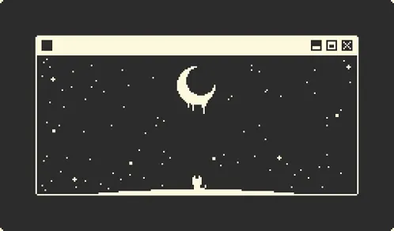

<!--horizontal divider(gradiant)-->

<!--h1 without bottom border-->

  <ul align="center">
    
<h1 style="display: inline-block; color: #F5F5DC;">¡Hola! Soy Walter👋</h1>

  </ul>

<!--- banner -->

  

<!--h2 without bottom border-->

  <ul align="center">
    
<h2 style="display: inline-block; color: #E07B39;">« Equivocarse es solo otro paso hacia el código perfecto »</h2>

  </ul>

<!--Intro start-->

    

Soy Desarrollador Web Full-Stack especializado en el stack MERN (MongoDB, Express.js, React, Node.js). Me apasiona crear aplicaciones web dinámicas e intuitivas, enfocándome en brindar experiencias de usuario excepcionales. En mis proyectos y colaboraciones, combino creatividad y eficiencia para resolver problemas y construir soluciones innovadoras.
    

<!--Intro end-->

<!--- snake -->

  

<!--- stats & Trophy (start) -->

  <!--- stats (start) -->
<table align="center" border="none">
<tr border="none">
<td width="50%" align="center">
  
  
    
   
</td>

<td width="50%" align="center">
  
  </td>
</tr>
</table>
<!--- stats (end) -->

<!--- trophy (start) -->

  

<!--- trophy (start) -->

        
<!--- stats (end) -->

<!--h1 without bottom border-->

  <ul align="center">
    
<h2 style="display: inline-block; color: #E07B39">Tecnologías que conozco👨🏻‍💻</h2>

  </ul>

<!--tech stack icons-->

  

<!-- Connect with me -->
<!--h2 without bottom border-->

  <ul align="center">
    
<h2 style="display: inline-block; color: #E07B39">¡Hablemos!🤝</h2>

  </ul>

<!--icons and links-->

  

<!--profile visit count-->

  

  

<!--horizontal divider(gradiant)-->
